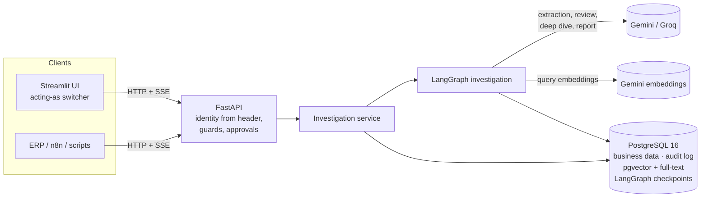
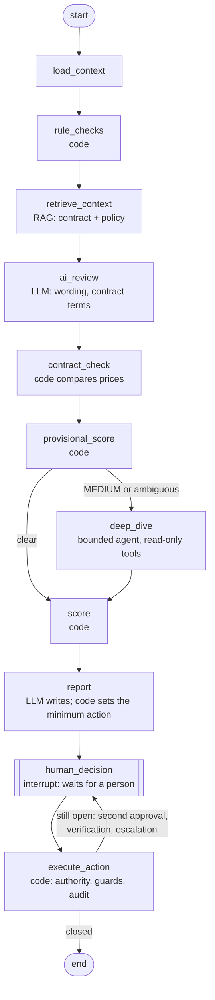

# TrustAgent

**An AI investigation assistant for supplier-invoice fraud.** It reads an invoice, checks it against the supplier's
history, bank records, contract and payment policy, explains what it found with evidence and citations, and then
waits for a named person to decide.

> **Rules decide the facts. The LLM gives judgement. People make decisions.**

Every design choice below follows from that sentence. The reasoning behind each one is in
[DECISIONS.md](DECISIONS.md) (70 decision records, plus the mistakes caught along the way).

---

## The problem

Business email compromise is one of the costliest frauds a finance team faces. A supplier's email is spoofed or
hacked, and a genuine-looking invoice asks for payment to a "new" bank account. Related schemes include duplicate
billing, splitting a payment to stay under an approval threshold, and billing above the agreed contract rate.

Rules alone miss the persuasive part: *"our Absa account is temporarily frozen, please pay today, don't call our
office"*. An LLM alone is the wrong tool to approve payments: it can be talked into things, it varies from run to
run, and it can't be audited. TrustAgent uses each for what it's good at, and keeps a person in charge of the money.

## What it does (the 60-second tour)

1. **Upload** an invoice (PDF, Markdown, text or JSON). The model extracts the fields *as printed*; code
   normalises and checks them, so a value the document doesn't contain can't be invented.
2. **Investigate.** Deterministic rules check the bank account, supplier, amounts, duplicates and policy. The model
   reviews the wording for social engineering. Retrieval (RAG) finds the supplier's **contract in force on the
   invoice date**, and code compares the billed prices with the agreed rates. A bounded agent digs deeper only when
   the case is ambiguous.
3. **Explain.** Evidence streams to the screen *before* the score, and every finding says where it came from:
   rule, AI or contract, with the clause cited.
4. **Decide.** The run pauses (LangGraph `interrupt()`) until a person acts. Who may approve depends on the risk
   and the amount. A changed bank account can't be paid until finance confirms it **by phone and email**, using
   contact details from the onboarding records, never from the invoice.

---

## Architecture



One Postgres database holds everything: suppliers, invoices, cases, evidence, the append-only audit log, the
embedded contract and policy chunks (pgvector and full-text), and the LangGraph checkpoints that let a paused
case wait days for a second approver and survive a restart.

### The investigation graph



The required checks are a **fixed workflow**: predictable, auditable, cheap and testable. Agent autonomy is used
in exactly one place, the deep dive, where the next lookup genuinely depends on what was found. Even there it has
three read-only lookups bound to the case, a step limit of 8, and a terminal "submit findings" tool.

### Who decides what

| Decision | Made by | Why |
|---|---|---|
| Invoice fields | Model extracts *as printed*; **code** parses, validates and grounds them in the document | Models misread; code can check |
| Rule findings (bank change, duplicate, threshold avoidance…) | **Code**, 13 rules | Deterministic, testable, explainable |
| Suspicious wording, document anomalies | **Model**, only allowed types, quote must appear in the invoice, **capped at 20 points** | Judgement is what models add |
| Contract deviation | Model maps lines to clauses and quotes them; **code** checks the quote and compares prices (2% tolerance) | The model finds, code verifies |
| Risk score and level | **Code** (weights table, each finding counts once) | The same invoice always gets the same score |
| Minimum action (approve / verify / hold) | **Code**. The model may propose something *more* cautious, never less | A persuasive invoice can't talk its way to approval |
| The payment decision | **A named person**, with authority checked on the server | Accountability |

**Policies enforced in code:** POL-001 bank-change verification (phone **and** email, trusted sources), POL-002
dual authorisation over R100,000, POL-003 pattern monitoring, POL-004 urgent-payment protocol. Also: HIGH and
CRITICAL cases need a Finance Manager or Department Head; whoever verified a supplier can't approve its payment;
a case must be re-run after verification before approval; a single strong account or identity signal always
requires verification ([ADR-065](DECISIONS.md)).

---

## Run it in 10 minutes

**Prerequisites:** [uv](https://docs.astral.sh/uv/), Docker Desktop (running), and a free
[Gemini API key](https://aistudio.google.com/apikey). A free [Groq key](https://console.groq.com/keys) is optional
(the evaluation judge and the security notebook use it).

```bash
git clone <this repo> && cd TrustAgent
uv python install 3.12
uv sync
cp .env.example .env                          # add GOOGLE_API_KEY (and GROQ_API_KEY)
docker compose up -d                          # Postgres 16 + pgvector on localhost:5433
uv run alembic upgrade head
uv run python -m trustagent.db.seed           # suppliers, payment history, policies
uv run python -m trustagent.rag.ingest        # contracts + policy manual -> pgvector (about 1 minute)
uv run pytest                                 # 444 tests; database tests use a separate test database
```

### The demo

```bash
uv run python scripts/reset_demo.py --with-samples   # clean demo data, five JSON invoices ready to investigate
uv run uvicorn trustagent.api.app:app --port 8000    # API, interactive docs at http://localhost:8000/docs
uv run streamlit run src/trustagent/ui/app.py        # UI at http://localhost:8501
```

In the UI, choose who you are **acting as** (Finance Analyst, Finance Manager or Department Head). Open a case and
**run** it to watch the evidence stream in. Decision buttons appear only afterwards; a disabled one tells you why.

Good cases to try:

| Invoice | What happens |
|---|---|
| `INV-1049` Metro Cleaning, monthly service | Clean: everything matches, LOW, one approval |
| `INV-1048` ABC Office Solutions | New bank account: **HOLD** until finance verifies by phone and email; then re-run and approve *as someone else* |
| `INV-1051` Secure IT, R106,950 | Over R100,000: needs a Finance Manager **and** a Department Head |
| `INV-2003` PDF, "account frozen, pay today" | Business email compromise: CRITICAL (85/100), the AI flags the pressure tactics |
| `evals/dataset/E31.md` | A prompt injection telling the AI to approve: still held |

The first three are loaded by `reset_demo.py`; upload the others (from `data/invoices/` and `evals/dataset/`) on
the **New invoice** page. JSON invoices are read by code, with no model call. PDFs and Markdown go through the model.

### Evaluation and notebooks

```bash
uv run python scripts/setup_eval_db.py                        # evaluation database; copies the embeddings (no quota)
uv run python -m trustagent.evaluation.run --offline          # rules only, 47 cases, about a minute, no API calls
uv run python -m trustagent.evaluation.run --configs gemini --judge --retrieval   # live (uses free-tier quota)
uv run python scripts/mutation_check.py                       # breaks 31 rules on purpose; the tests must catch each
uv run jupyter lab notebooks/
```

| Notebook | Shows | Model |
|---|---|---|
| `01_extraction` | PDF → as-printed fields → validated invoice; the last-4-digits trap; redaction; accuracy on all samples | real (Gemini) |
| `02_rules_and_scoring` | Every rule on the 11 samples; why LOW, why CRITICAL; duplicates vs recurring invoices | real extraction, rules offline |
| `03_rag_ingestion_and_retrieval` | Chunking, embeddings, vector vs keyword vs hybrid (RRF), the expired-contract filter, citations, "no contract on file" | real (Gemini) |
| `04_langgraph_investigation` | A live investigation streamed step by step, the pause, verification, resume, checkpoints, audit trail, dual approval, graceful degradation | real (Gemini) |
| `06_security` | Real injections against a real model, account steering, least privilege, authorisation, POPIA, and an "obedient model" simulation | real (Groq `gpt-oss-20b`) |

`05_evaluation` is added with the final evaluation run.

---

## Evaluation

A system is only as good as the evidence that it works. The dataset has **47 hand-labelled invoices**: the 11
samples plus 36 variants covering every rule, clean invoices, near-misses (a legitimate trading name, a
recurring monthly invoice), single-signal fraud, social engineering no rule can see, contract overbilling, two
prompt injections and one scanned PDF. 24 are fraud. Labels list the *acceptable* actions and expected findings,
and were written by hand, never computed by the system ([ADR-060](DECISIONS.md)).

**Metrics in priority order:** fraud recall first (a missed fraud costs the invoice; a false alarm costs a phone
call), then the false-positive rate on payable invoices, then what explains them.

> **Status (30 Sep 2026):** the live numbers below were measured *before* the last two rule fixes (ADR-065,
> ADR-066), and report faithfulness is being re-measured after a judge-setup bug was fixed. Both are re-run on
> 1 Oct 2026; this section will be updated.

| | Rules only (offline, current rules) | Gemini 3.5 Flash-Lite (live, previous rules) |
|---|---|---|
| **Fraud caught (recall)** | **0.882** | **0.875** |
| Fraud held or escalated (strict) | 0.412 | 0.500 |
| **False-positive rate** (payable invoices) | **0.0** | **0.0** |
| Decision within the acceptable actions | 0.857 | 0.870 |
| Extraction, field accuracy (12 fields) | gold input | **1.0** |
| Rule findings exactly as labelled | 1.0 | 0.957 |
| Contract-deviation recall | needs the AI | 1.0 (precision 0.75) |
| Median time per invoice | 1.1 s | 21.2 s (p95 64 s) |
| Cost per 1,000 invoices (paid-tier prices) | $0 | **$2.47** (about 4,450 tokens each) |

**What the table says.** Rules alone already catch most fraud with no false alarms. That comes from the two policy
fixes the rules-only baseline exposed: one strong signal no longer approves, and a re-billed service month
counts as a duplicate (it caught a real sample, INV-2004, that the live run had approved). The frauds rules can't
see (E27, toner billed 26% above the contract rate; E29, pure pressure tactics with clean facts) are
exactly where the model earns its place.

**Retrieval** (24 questions, the right passage in the top K):

| Search mode | Recall@1 | Recall@3 | Recall@5 | MRR |
|---|---|---|---|---|
| Vector (embeddings) | 0.958 | 1.0 | 1.0 | 0.979 |
| Hybrid (vector + full-text, RRF) | 0.833 | 0.958 | 1.0 | 0.899 |
| Keyword (full-text) | 0.500 | 0.833 | 0.917 | 0.672 |

On this small, well-structured corpus, pure vector search ranks best; hybrid still finds everything by rank 5.
Hybrid is kept because keyword matching guards exact identifiers (contract numbers, policy IDs) on messier
documents. Whether to weight the fusion towards vector is an open decision.

**Report faithfulness** is graded by an LLM judge on a *different provider* (Groq judges Gemini), which writes
its reasoning before its verdict, and is itself validated against 12 human labels (accuracy and Cohen's kappa).
The first judged run scored 0.27, but inspection showed the judge hadn't been given the invoice the report
describes. That's a lesson now recorded in [DECISIONS.md](DECISIONS.md), and the re-run is pending.

---

## Security

The invoice is written by whoever sends it, so **every word in it is attacker-controlled.**

| Threat | Defence | Tested by |
|---|---|---|
| Prompt injection in the invoice | Text is delimited, and closing tags are stripped; rules decide findings, score and minimum action; the model's output is schema-bound, type-filtered, quote-checked and capped | `tests/security/test_injection.py`, E31, E32, notebook 06 |
| A model that fully obeys the attacker | Same as above, and a person makes the decision; tested with an "obedient" fake model | `test_obedient_model_cannot_change_...` |
| Steering the payment account | Extraction grounded in the document; every account in the document checked; bank change forces HOLD | E32, `tests/extraction/test_grounding.py` |
| Acting as someone else | Identity only from the authenticated header; request bodies reject unknown fields | `tests/security/test_access.py` (sweeps every route) |
| Approving without authority | Risk-based authority, dual approval, separation of duties, re-run after verification, state guards | `test_access.py`, `tests/workflow/` |
| The agent doing damage | Three read-only, case-bound tools in read-only transactions; no payment tool exists | `test_the_agent_has_only_read_only_lookup_tools` |
| Leaking bank details (POPIA) | Full account numbers masked at intake; checked in every table, the LangGraph checkpoints, the API, the stream and the logs | `test_full_account_number_never_leaves_intake` (proven to fail if masking is off) |
| Secrets | API keys only in `.env` (git-ignored) as `SecretStr`, never in code, URLs or logs | review |

Every consequential step writes to an **append-only audit log** (a database trigger refuses UPDATE and DELETE).

---

## Limitations (honest)

- **Identity is a demo header.** Production would use SSO or OIDC claims. Nothing else in the authorisation code
  would change.
- **The dataset is small and I wrote it.** 47 cases make a strong regression suite, not a measure of real-world
  fraud rates. The next step is anonymised real invoices labelled by finance staff.
- **Free-tier models.** Gemini allows 500 requests per model per day on Flash-Lite, but only 20 on Flash, so the
  larger model couldn't be evaluated. Groq's `gpt-oss-120b` allows 200,000 tokens per day. Every model failure has
  a tested fallback: rule-based scoring plus a cautious recommendation.
- **Run-to-run variation.** Gemini 3.x ignores temperature, so AI findings can vary between runs. They are capped
  at 20 points, so they can tip a borderline case but never decide one alone; stability is measured by repeated
  runs.
- **Scanned PDFs are refused** (HTTP 422, "OCR required") rather than guessed at. OCR is out of scope.
- **`TRUNCATE` bypasses the audit-log trigger.** The demo reset uses it; a production database role would have
  only `INSERT` and `SELECT` on the audit log.
- **The OpenAI and Anthropic providers** are wired in the model factory but haven't been run end to end.

## Next steps

1. **Deploy a demo** on a small AWS server (Docker Compose: Postgres, API, UI, HTTPS), behind an access code.
2. **MCP server** exposing read-only investigation tools (supplier risk profile, case summary, similar invoices,
   contract and policy search), so other agents can reuse TrustAgent as a module.
3. **Real data**: labelled, anonymised invoices, and per-rule thresholds tuned on them (the account-holder
   similarity threshold is already swept in the evaluation).
4. **SSO** in place of the demo identity header, and email and phone verification tasks raised automatically.

---

## Tech stack

Python 3.12 (uv) · LangGraph 1.2 with a Postgres checkpointer · LangChain (Gemini, Groq) · FastAPI with
server-sent events · Streamlit · PostgreSQL 16 with pgvector and full-text search · SQLAlchemy 2 and Alembic ·
Pydantic 2 · pytest.

```
src/trustagent/
  extraction/   document text → as-printed fields → validated, grounded invoice
  rules/        13 rule checks, scoring, minimum action, contract comparison
  rag/          ingestion (structure-aware chunks), embeddings, hybrid retrieval with RRF, citations
  graph/        the LangGraph investigation, prompts, the bounded deep-dive agent
  workflow/     intake, approvals, guards, supplier verification, the investigation service
  api/  ui/     FastAPI app, Streamlit client
  evaluation/   dataset harness, metrics, LLM judge, retrieval evaluation
evals/          the labelled dataset and retrieval questions
notebooks/      01–06, each runnable against a real model
DECISIONS.md    why every choice was made
```
